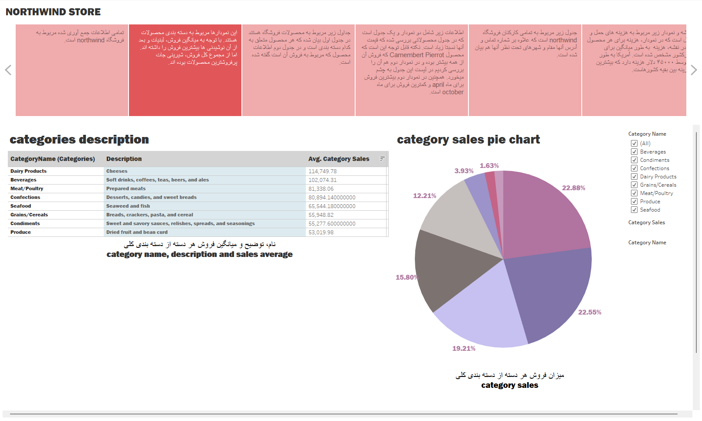
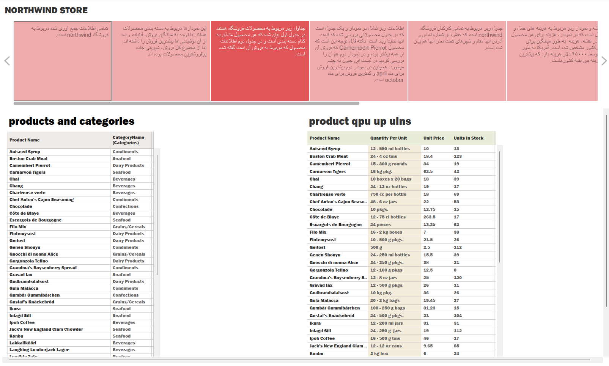
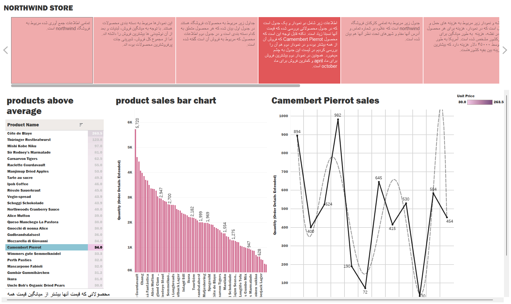
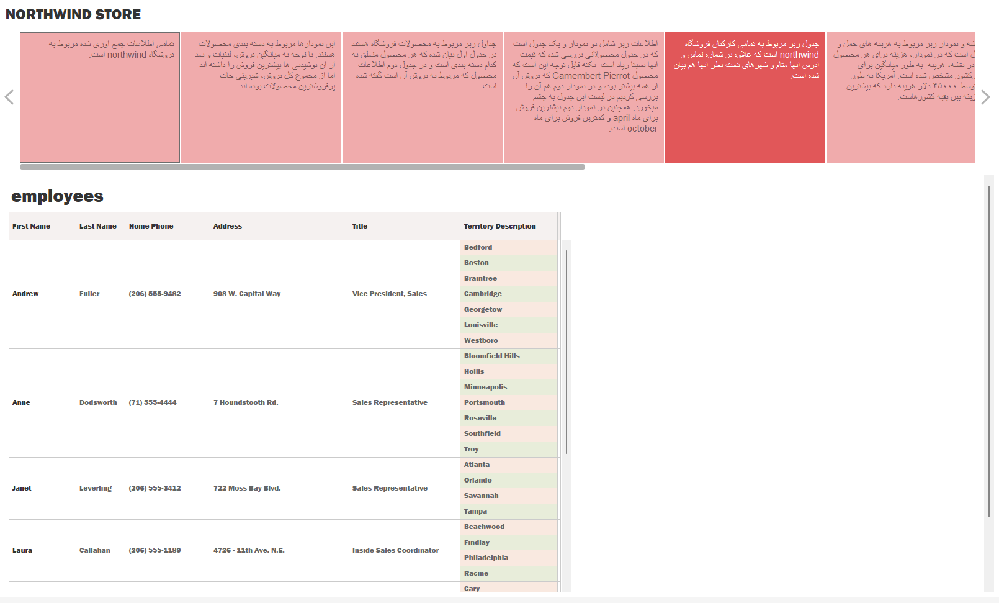
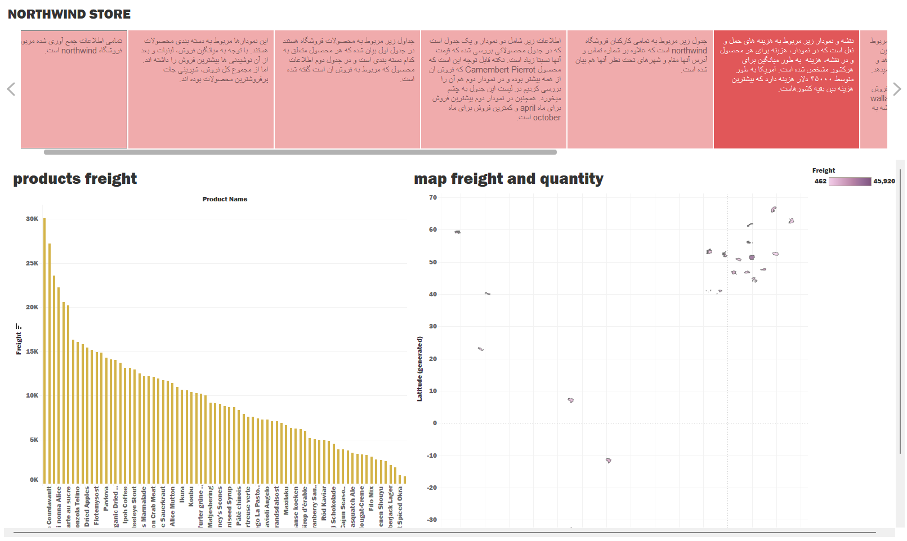
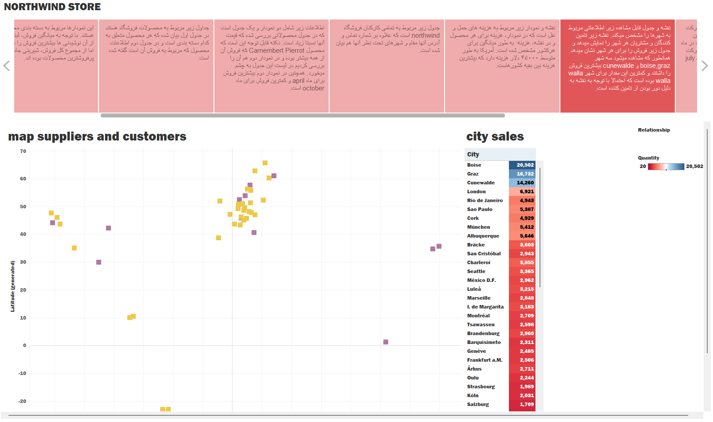
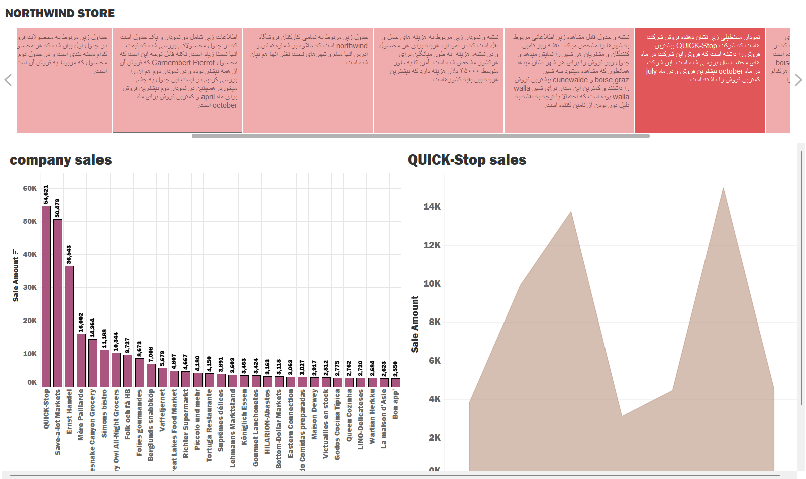
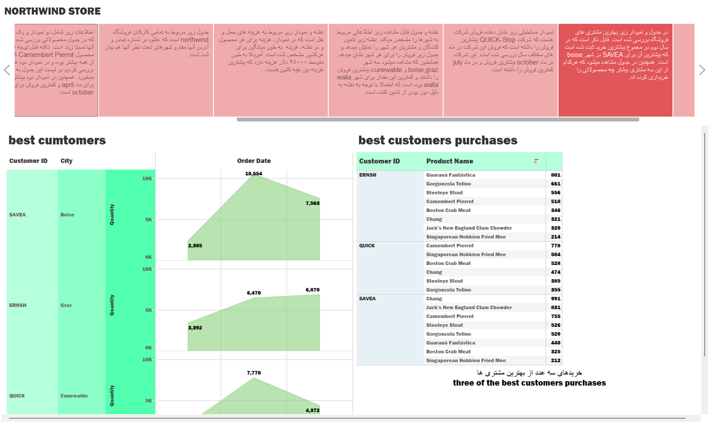

# Tableau storytelling with the Northwind data

Final project for a course in my bachelor's (January 2020). I built an eight-page Tableau story on the Northwind sample database: products, sales, employees, suppliers and customers.

Open `northwind-story.twb` in Tableau Desktop (made with version 2019.3). The data is in `finalProject.xlsx` and the `.hyper` extracts.

## The pages

1. Categories: average sales per category and each category's share of total sales.

2. Products and categories: product list with quantity per unit, unit price and units in stock.

3. Products above the average price, product sales, and the monthly sales of Camembert Pierrot (April to October).

4. Employees with their job titles and territories.

5. Freight cost per product, and a map of where products are shipped.

6. Suppliers and customers on a map, and sales by city. Cunewalde, Boise, Graz and Walla Walla sell the most.

7. Sales by company. QUICK-Stop is the biggest customer, with its peak in October and its low in July.

8. Best customers (SAVEA, ERNSH and QUICK) and what they buy most.

